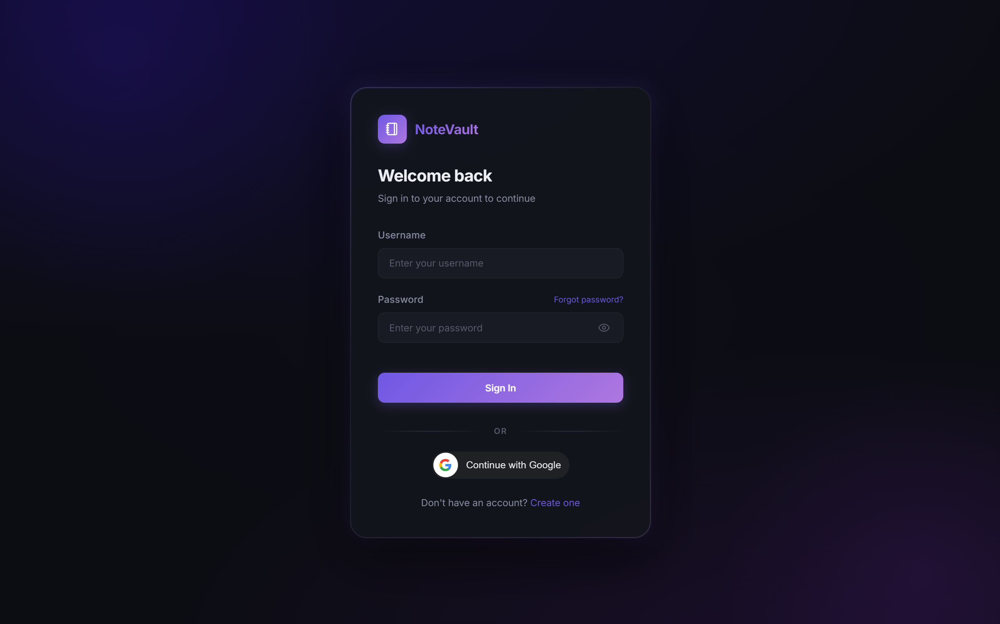
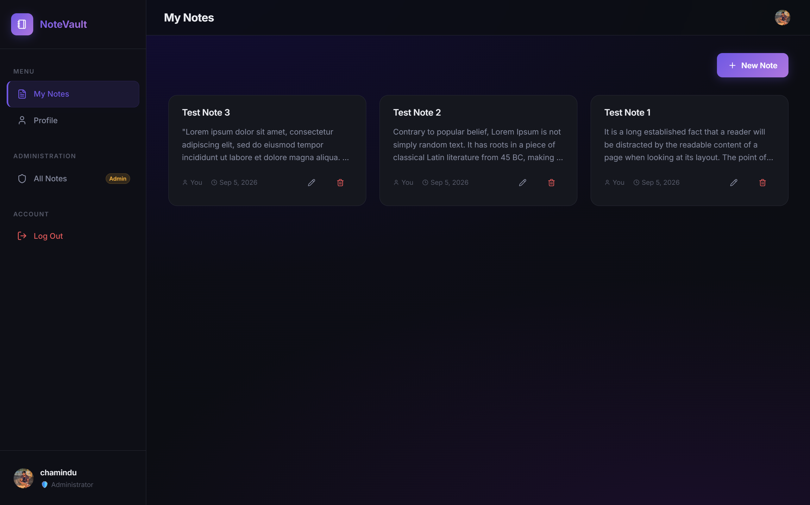
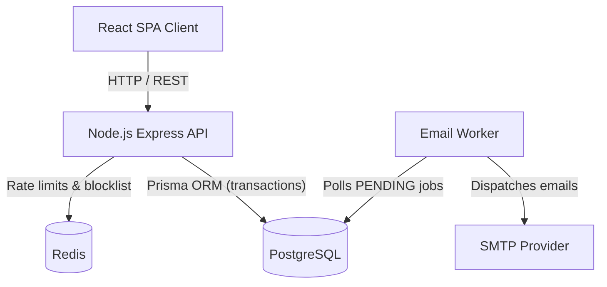
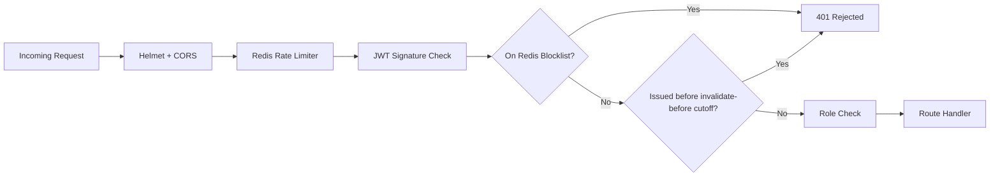

# NoteVault

> A secure, production oriented reference architecture for full-stack authentication and transactional email systems, built around a notes management application.

[](./LICENSE)
[](#prerequisites)
[](#technology-stack)
[](#technology-stack)
[](#technology-stack)

## Table of Contents

- [Overview](#overview)
- [Screenshots](#screenshots)
- [Why This Project?](#why-this-project)
- [Core Engineering Concepts](#core-engineering-concepts)
- [Key Features](#key-features)
- [Architecture](#architecture)
- [API Overview](#api-overview)
- [Technology Stack](#technology-stack)
- [Prerequisites](#prerequisites)
- [Installation & Setup](#installation--setup)
- [Production Considerations](#production-considerations)
- [Known Limitations & Roadmap](#known-limitations--roadmap)
- [License](#license)

## Overview

While on the surface NoteVault operates as a standard Notes Management Web Application (CRUD), its primary engineering focus is security and resilience. The notes management functionality acts as a realistic domain to showcase a highly secure authentication system and reliable/persistent email job delivery.

This project implements modern defense in depth strategies to mitigate common web vulnerabilities like XSS, CSRF, replay attacks, and brute-force attempts, making it a reference architecture for full-stack Node.js and React applications.

📖 For implementation-level detail, see [`docs/`](./docs):

- [Security & Authentication Architecture](./docs/SECURITY.md)
- [Email System Architecture](./docs/EMAIL_SYSTEM.md)
- [System Architecture & Deployment](./docs/ARCHITECTURE.md)

## Screenshots

| Login                                     | Dashboard                               |
| ----------------------------------------- | --------------------------------------- |
|  |  |

## Why This Project?

Most tutorials and student portfolio projects implement "happy path" authentication (e.g., storing long-lived JWTs in `localStorage`). Real world, production oriented applications require significantly more rigor. NoteVault was built to explore and implement these complex, critical backend engineering concepts:

- **Token Security** — how do you reduce XSS token exfiltration risk while keeping the application stateless where it counts?
- **State Invalidation** — how do you instantly revoke a stateless JWT upon suspicious activity or user logout?
- **Data Integrity** — how do you guarantee an email is sent only if the database transaction commits, and what happens if the SMTP server goes down?
- **Abuse Prevention** — how do you prevent credential stuffing and brute-force attacks in a distributed environment?

## Core Engineering Concepts

NoteVault demonstrates practical implementations of several advanced patterns:

- **Robust Token-Based Rotation** — short-lived access tokens (kept in memory) and long-lived refresh tokens (`httpOnly` cookies) with cryptographic reuse detection.
- **Stateless/Stateful Hybrid Auth** — using Redis to maintain a blocklist and "invalidate-before" timestamps for instant session revocation while preserving JWT scalability.
- **Transactional Outbox Pattern** — decoupling database transactions from network-bound email dispatch, ensuring reliable/persistent email job delivery.
- **Idempotency & Resilience** — background workers utilizing exponential backoff and jitter to recover from transient SMTP failures.
- **Horizontal Scalability** — Redis-backed Lua scripts for atomic, distributed rate limiting and account lockouts.

<details>
<summary>Where each concept lives in the code</summary>

| Concept                                                    | Where it lives                              |
| ---------------------------------------------------------- | ------------------------------------------- |
| Refresh token rotation with reuse detection                | `backend/src/modules/auth`                  |
| Token-family invalidation on replay                        | `backend/src/modules/auth`                  |
| Hybrid revocation: Redis blocklist + `iat` cutoff          | `backend/src/middlewares/authenticate.js`   |
| Atomic, distributed rate limiting (Redis + Lua)            | `backend/src/middlewares`                   |
| CSRF mitigation via custom header + CORS                   | `backend/src/app.js`                        |
| Transactional outbox pattern                               | `backend/src/modules/email`                 |
| Background worker with backoff, jitter, stuck-job recovery | `backend/src/modules/email/email.worker.js` |
| Tenant isolation at the ORM layer                          | `backend/prisma/schema.prisma`              |

</details>

## Key Features

### Authentication & Security

- **Dual-token architecture** — short-lived JWT access tokens, long-lived refresh tokens.
- **Refresh token rotation** with cryptographically secure reuse detection.
- **Reduced XSS exposure** — access tokens are held in memory only, never in `localStorage`/`sessionStorage`; refresh tokens live in `httpOnly`, `secure`, `SameSite` cookies.
- **Instant revocation** via a Redis-backed access-token blocklist.
- **"Logout everywhere"** — invalidates all token families and rejects any access token issued before the invalidation timestamp.
- **Rate limiting & account lockout** — Redis-backed, atomic across instances.
- **Password reset** via single-use, expiring, hashed tokens.
- **Google OAuth sign-in** with automatic account linking.
- **Role-based access control** (`USER` / `ADMIN`).
- **CSRF mitigation** on cookie-authenticated endpoints.

### Email System

- **Transactional outbox pattern** — email jobs are written in the same DB transaction as the action that triggers them, so a request can't succeed while its email is silently dropped.
- **Background delivery worker**, decoupled from the HTTP request/response cycle.
- **Exponential backoff with jitter** on delivery failure, plus automatic recovery of jobs stuck mid-delivery.

### Notes CRUD

- Per-user isolation enforced at the database layer.
- Unique note titles per user.

---

## Architecture



### Security Layers

Every authenticated request passes through the same defense-in-depth pipeline before it reaches business logic:



Full sequence diagrams for token rotation and reuse detection live in [`docs/SECURITY.md`](./docs/SECURITY.md).

---

## API Overview

| Method      | Endpoint                    | Description                                 | Auth        | Rate Limit |
| ----------- | --------------------------- | ------------------------------------------- | ----------- | ---------- |
| **Auth**    |                             |                                             |             |            |
| POST        | `/api/auth/register`        | Register a new user                         | —           | —          |
| POST        | `/api/auth/login`           | Authenticate and issue tokens               | —           | 5 / min    |
| POST        | `/api/auth/refresh`         | Rotate refresh token for a new access token | Cookie      | 10 / min   |
| POST        | `/api/auth/logout`          | Revoke current session, blocklist token     | Yes         | —          |
| POST        | `/api/auth/logout-all`      | Revoke all sessions for the user            | Yes         | —          |
| POST        | `/api/auth/google`          | Google sign-in / sign-up                    | —           | —          |
| POST        | `/api/auth/forgot-password` | Request a password reset email              | —           | 3 / 15 min |
| POST        | `/api/auth/reset-password`  | Fulfill a password reset                    | —           | —          |
| **Profile** |                             |                                             |             |            |
| GET         | `/api/profile`              | Get authenticated user's profile            | Yes         | —          |
| PATCH       | `/api/profile`              | Update profile                              | Yes         | —          |
| DELETE      | `/api/profile`              | Delete account                              | Yes         | —          |
| **Notes**   |                             |                                             |             |            |
| POST        | `/api/notes`                | Create a note                               | Yes         | 20 / min   |
| GET         | `/api/notes/my-notes`       | List the current user's notes               | Yes         | —          |
| GET         | `/api/notes`                | List all notes                              | Yes (ADMIN) | —          |
| GET         | `/api/notes/:id`            | Get a specific note                         | Yes         | —          |
| PATCH       | `/api/notes/:id`            | Update a note                               | Yes         | —          |
| DELETE      | `/api/notes/:id`            | Delete a note                               | Yes         | —          |

---

## Technology Stack

| Category             | Technology                 | Purpose                         |
| -------------------- | -------------------------- | ------------------------------- |
| **Frontend**         | React 19, TypeScript       | Core UI                         |
|                      | Vite                       | Build tool & dev server         |
|                      | Redux Toolkit (RTK)        | Global state                    |
|                      | RTK Query                  | Data fetching & caching         |
|                      | React Hook Form + Zod      | Form state & validation         |
| **Backend**          | Node.js (ESM), Express     | API server                      |
|                      | Prisma                     | Database ORM                    |
|                      | Zod                        | Request payload validation      |
|                      | bcrypt, jsonwebtoken       | Password hashing & JWT          |
|                      | Winston                    | Structured logging              |
| **Email**            | Nodemailer                 | SMTP dispatch                   |
|                      | Custom worker + DB polling | Outbox delivery, backoff/jitter |
| **Database / Cache** | PostgreSQL                 | Primary relational store        |
|                      | Redis (ioredis)            | Rate limiting, token blocklist  |

---

## Prerequisites

- Node.js 20 LTS or later
- npm 10+ (or pnpm/yarn if you adapt the lockfiles)
- PostgreSQL 14+ (e.g. a free [Neon](https://neon.tech) instance)
- Redis 6+ (local, Docker, or a managed instance)
- An SMTP provider for local testing (e.g. Mailtrap, or Gmail with an app password)
- A Google Cloud OAuth 2.0 Client ID (for Google sign-in)

## Installation & Setup

1. **Clone the repository**

   ```bash
   git clone https://github.com/Chamindu-Dharmawickrama/note_vault.git
   cd note_vault
   ```

2. **Backend**

   ```bash
   cd backend
   npm install
   cp .env.example .env   # populate with your own values
   npx prisma db push
   npm run dev
   ```

3. **Frontend**
   ```bash
   cd ../frontend
   npm install
   cp .env.example .env   # populate with your own values
   npm run dev
   ```

The full list of required `.env` values is in [`docs/ARCHITECTURE.md`](./docs/ARCHITECTURE.md#environment-variables).

---

## Production Considerations

- **HTTPS is required** — the auth flow depends on `secure` cookies and will not work over plain HTTP.
- **Trust the proxy** — behind Nginx/ALB, set `app.set('trust proxy', 1)` so rate limiters read the real client IP.
- **`ALLOWED_ORIGINS` must exactly match your frontend domain**, or CORS will silently break auth.
- **Ship logs somewhere** — Winston emits structured JSON in production; wire it to Datadog, Loki, or CloudWatch.

Deployment, database schema, and graceful-shutdown details are in [`docs/ARCHITECTURE.md`](./docs/ARCHITECTURE.md).

---

## Known Limitations & Roadmap

This is a focused reference architecture for the auth and email layers, not a fully productionized SaaS. Being upfront about the gaps:

- **Automated test suite** — the security-critical paths (rotation, reuse detection, blocklist checks) are exactly the code that benefits most from integration tests; this is the top priority before calling the project "production-ready" rather than "production-oriented."
- **CI/CD pipeline** — linting, type-checking, and tests aren't yet wired into a pipeline (e.g. GitHub Actions).
- **Containerization** — no `Dockerfile` / `docker-compose.yml` yet for one-command local spin-up of Postgres + Redis + the app.
- **Email throughput** — the polling-based worker (see [`docs/EMAIL_SYSTEM.md`](./docs/EMAIL_SYSTEM.md#trade-offs)) is reliable but not instant, and won't scale to high volume the way a real queue (SQS, BullMQ) would.
- **Multi-region deployment** — rate limiting and blocklisting assume a single Redis instance; running across regions would need session/cache replication designed explicitly.

Contributions and issues are welcome if you'd like to help close any of these.

## License

Licensed under the [MIT License](./LICENSE).
