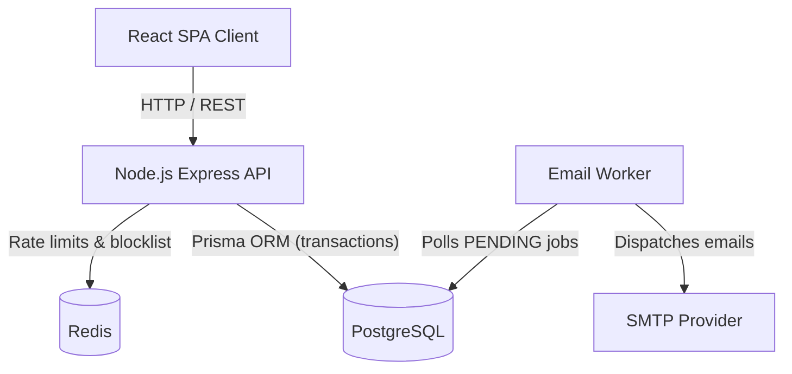

# System Architecture & Deployment

## High-Level Architecture



## Request Middleware Chain

Every backend request passes through, in order:

1. **Request ID** — a UUID is attached to `res.locals.requestId` and response headers for distributed tracing.
2. **Helmet + CORS** — secure headers, strict origin allowlist.
3. **Cookie/body parsing** — `httpOnly` cookies, JSON bodies capped at 10 KB.
4. **Compression** — gzip/deflate.
5. **Logging** — Winston, JSON in production, colorized in development.
6. **Authentication** — JWT signature check, Redis blocklist check, RBAC.

## Database Schema (Prisma)

| Model | Purpose |
|---|---|
| `User` | Credentials, role (`USER`/`ADMIN`), Google ID, lock status |
| `Note` | Belongs to `User`; unique `[userId, title]` |
| `RefreshToken` | Token hash, family ID, revoked flag |
| `PasswordReset` | Single-use, hashed, expiring reset tokens |
| `EmailJob` | Outbox queue table for the email worker |

Cascading deletes are used throughout, so deleting a `User` cleans up their notes, tokens, and pending resets.

## Folder Structure

```text
notevault/
├── frontend/
│   ├── src/
│   │   ├── app/          # Redux store & global configuration
│   │   ├── features/     # Feature-sliced domains (auth, notes, profile)
│   │   └── shared/       # Shared UI components, hooks, and utilities
│   └── package.json
└── backend/
    ├── src/
    │   ├── config/       # Env variables, database, redis, logger config
    │   ├── middlewares/  # Auth, rate limiters, validation, error handlers
    │   ├── modules/      # Domain controllers, services, repositories, validators
    │   ├── utils/        # Token helpers, response formatters, catchAsync
    │   ├── server.js     # Entry point & graceful shutdown
    │   └── app.js        # Express app & global middleware
    ├── prisma/
    │   └── schema.prisma # Database models
    └── package.json
```

The frontend follows feature-sliced design: each domain (`auth`, `notes`, `profile`) owns its own API slice, components, pages, and validation, rather than splitting by technical layer.

## Environment Variables

### Backend (`backend/.env`)

| Variable | Description | Required |
|---|---|---|
| `NODE_ENV` | `development` or `production` | Yes |
| `PORT` | API server port (e.g. 8000) | No |
| `DATABASE_URL` | PostgreSQL connection string | Yes |
| `REDIS_URL` | Redis connection string | Yes |
| `ALLOWED_ORIGINS` | Comma-separated CORS origins | Yes |
| `ACCESS_TOKEN_SECRET` | JWT access token signing secret | Yes |
| `REFRESH_TOKEN_SECRET` | JWT refresh token signing secret | Yes |
| `SMTP_HOST` / `SMTP_PORT` / `SMTP_USER` / `SMTP_PASS` | SMTP credentials | Yes |
| `GOOGLE_CLIENT_ID` | Google OAuth client ID | Yes |

The server validates these on boot (`src/config/env.js`) and **refuses to start in production** if `DATABASE_URL` or `REDIS_URL` is missing.

### Frontend (`frontend/.env`)

| Variable | Description | Required |
|---|---|---|
| `VITE_API_URL` | Backend API URL | Yes |
| `VITE_GOOGLE_CLIENT_ID` | Google OAuth client ID | Yes |

## Graceful Shutdown

On `SIGTERM`/`SIGINT`, the server stops accepting new connections, waits for in-flight requests to finish, then cleanly disconnects from PostgreSQL and Redis before exiting. A forced timeout caps how long this can take, so the process can't hang indefinitely.

## Health Checks

`GET /api/health` checks PostgreSQL and Redis connectivity and returns `200` if both are healthy, `503` (degraded) otherwise — suitable for use as a load balancer or container orchestrator health probe.

## Production Checklist

- **HTTPS is required.** `secure` cookies mean the auth flow does not work over plain HTTP.
- **Trust the proxy.** Behind Nginx/ALB, set `app.set('trust proxy', 1)` so rate limiters see the real client IP rather than the proxy's.
- **`ALLOWED_ORIGINS` must exactly match your deployed frontend origin,** or CORS will silently break login/refresh.
- **Ship logs.** Winston's JSON output in production is meant to be piped to an aggregator (Datadog, Loki, CloudWatch, etc.).
