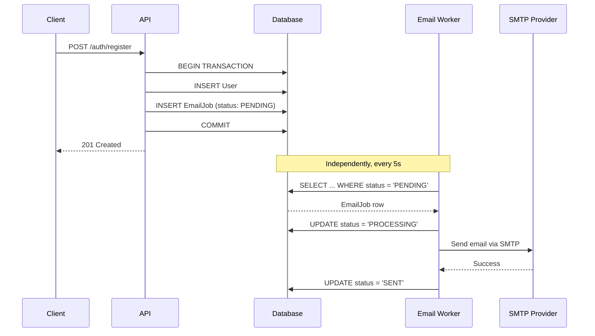

# Email System: Transactional Outbox Pattern

## The problem

Sending email synchronously from inside an HTTP request handler couples a fast, reliable operation (a database write) to a slow, unreliable one (an SMTP round-trip). Two failure modes follow directly from that:

- The SMTP call times out or errors → the whole request fails, even though the underlying action (e.g. creating the user) should have succeeded.
- The SMTP call succeeds but the DB write fails afterward → the user gets an email for something that never actually happened.

## The pattern

NoteVault avoids both failure modes with an outbox: instead of calling SMTP directly, the handler writes an `EmailJob` row **in the same database transaction** as the action that triggered it.

Because the job row and the triggering row commit together, delivery of the email becomes a property of the database transaction rather than the network call. The request either fully succeeds (row + job both committed) or fully fails (both rolled back). This makes email delivery **reliable and durable** — it does not guarantee an email is sent within any particular time window, and worker or SMTP-provider outages can still delay delivery.

## The worker

`src/modules/email/email.worker.js` polls the database for `PENDING` jobs on a fixed interval (5s) and dispatches them via Nodemailer.

- **Retry:** on failure, the job is retried with **exponential backoff and jitter** (up to 5 attempts), which spreads retries out instead of causing a thundering herd against a recovering SMTP provider.
- **Stuck-job recovery:** if the worker crashes mid-send, a job can be left in `PROCESSING` indefinitely. A watchdog resets any job that's been `PROCESSING` past a timeout back to `PENDING`, so it gets picked up again.

## Trade-offs

This is a polling-based outbox, which is simple to reason about and doesn't need a message broker — but it isn't instantaneous (worst case: ~5s delay) and won't scale to high email volume the way a queue like SQS or BullMQ would. For a notes app, that simplicity is the right trade-off; it's worth calling out explicitly if you're using this as a reference for a higher-throughput system.
