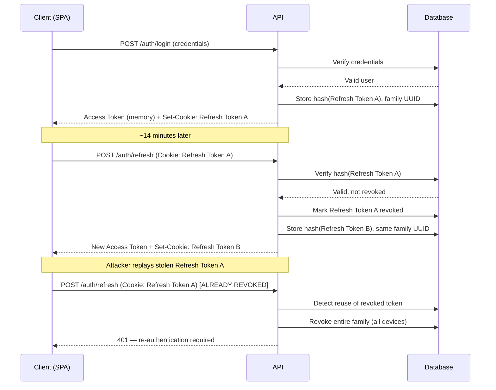

# Security & Authentication Architecture

This document covers the authentication and security implementation in depth. For the high-level summary, see the [README](../README.md).

## Token Architecture

NoteVault uses a custom, JWT-based dual-token authentication system. It is **not** a full OAuth 2.0 authorization-server implementation — there's no client registry, scopes, or grant types for the primary login flow. Its refresh-token rotation and reuse-detection design instead follows patterns described in the OAuth 2.0 Security Best Current Practice (RFC 9700), applied to a first-party session model. Google sign-in is the one place actual OAuth 2.0 / OpenID Connect is used, via Google Identity Services.

### Access Tokens (15 min expiry)
- Sent via `Authorization: Bearer <token>`.
- Held in memory only on the frontend, inside a `tokenService` module closure.
- Never written to `localStorage` or `sessionStorage`. This **reduces the risk of token exfiltration via XSS** — it is not a substitute for XSS prevention itself (input sanitization, CSP, etc. still matter), since an attacker with script execution in the page could still act as the user via the in-memory token during its short lifetime.

### Refresh Tokens (7 day expiry)
- Delivered via an `httpOnly`, `secure`, `SameSite` cookie (`__Secure-refreshToken` in production).
- Never accessible to JavaScript, which closes off the main XSS exfiltration path for this token.
- Hashed before being stored in the database — a database leak does not expose usable tokens.

## Refresh Token Rotation & Reuse Detection

Every refresh cycle:
1. Client sends the refresh cookie to `/api/auth/refresh`.
2. Backend verifies the token hash against the stored record.
3. The used token is marked `revoked`.
4. A new token pair is issued; the new refresh token shares the same `family` UUID as the one it replaced.

**Reuse detection:** if a previously-*revoked* token is presented again, the backend treats this as a strong signal that the token was intercepted and is being replayed by an attacker racing the legitimate user. Rather than just rejecting the single request, it revokes the **entire token family**, forcing re-authentication on every device tied to that login session.

## Revocation & Logout

| Action | Effect |
|---|---|
| `POST /auth/logout` | Clears refresh cookie, revokes that token's family, adds the current access token to the Redis blocklist (TTL = remaining access-token lifetime) |
| `POST /auth/logout-all` | Revokes every refresh token for the user, sets an `iat` "invalidate-before" timestamp in Redis |

Because JWTs are normally stateless (and can't be revoked before they expire), NoteVault adds two stateful checks on every authenticated request:
1. **Blocklist check** — is this exact access token blocklisted?
2. **`iat` check** — was this token issued *before* the user's invalidate-before timestamp?

Both are single Redis lookups, so revocation is enforced without a database round trip per request.

## CSRF Mitigation

Cookie-authenticated endpoints (`/api/auth/refresh`, `/api/auth/logout`) require an `X-Requested-With: XMLHttpRequest` header. Plain HTML forms can't set custom headers, and cross-origin `fetch`/`XHR` requests that try to would trigger a CORS preflight that the server's origin allowlist blocks. This is one defense layer, not the only one — it's paired with a strict `SameSite` cookie policy rather than relied on alone.

## Rate Limiting & Account Lockout

Rate limiting is Redis-backed and uses Lua scripts to keep the check-and-increment atomic across horizontal server instances (a plain read-then-write from multiple Node processes would race).

| Endpoint | Limit |
|---|---|
| `login` | 5 requests / minute |
| `refresh` | 10 requests / minute |
| `notes-create` | 20 requests / minute |
| `forgot-password` | 3 requests / 15 minutes |

Repeated failed logins additionally trigger a progressive account lockout.

## Other Hardening Details

- **Password hashing:** bcrypt, cost factor 12.
- **Timing attack mitigation:** login evaluates a dummy bcrypt hash when the user isn't found, so response time doesn't leak whether an email is registered.
- **Reset tokens:** single-use, expiring, hashed before storage — same treatment as refresh tokens.
- **RBAC:** `USER` / `ADMIN` roles enforced in the auth middleware.
- **Payload validation:** every request body is validated against a Zod schema before it reaches a controller; malformed payloads get a 422 without touching business logic.
